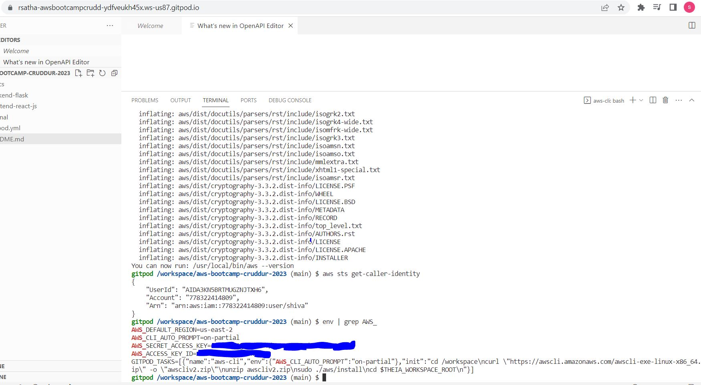

# Week 0 — Billing and Architecture
## Required HomeWork

### Install AWS CLI
I was able to install aws cli using the script added to gitpod.yml. 
Committed the code in the file gitpod.yml file.Initially made a mistake on the script and when i load the gitpod again, i noticed script is failing to install the aws. Then Fixed the issue and its working successfully .
Recommitted the code with the corrections.
Executed the cli command to verify the configuration completed.

## HomeWork Challengs.

