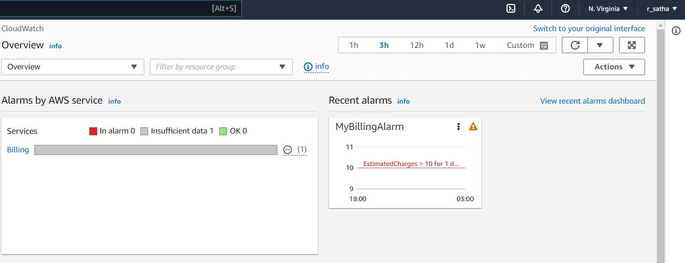
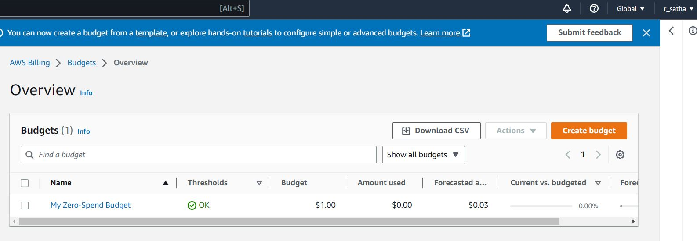
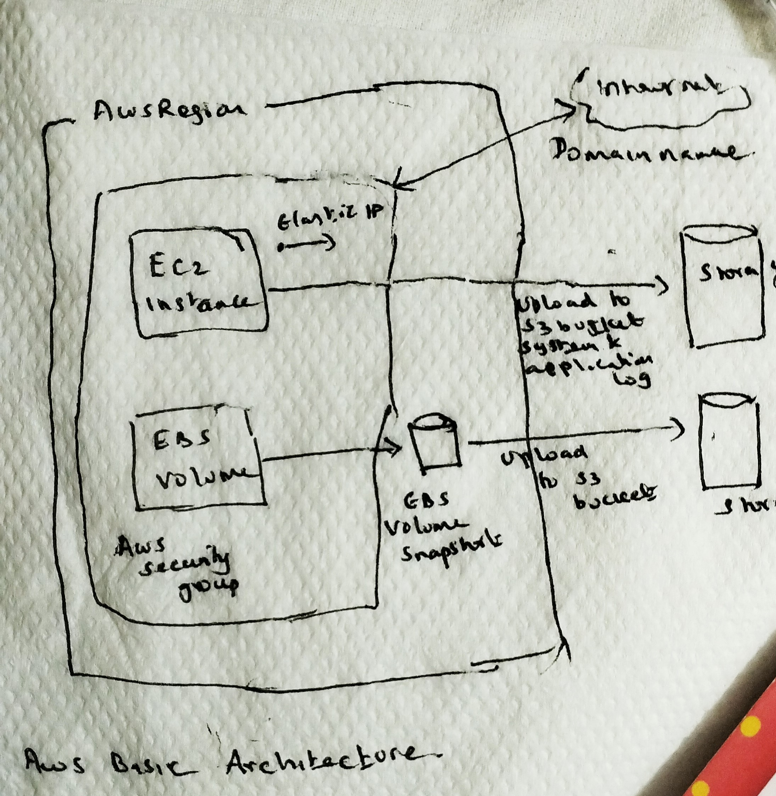
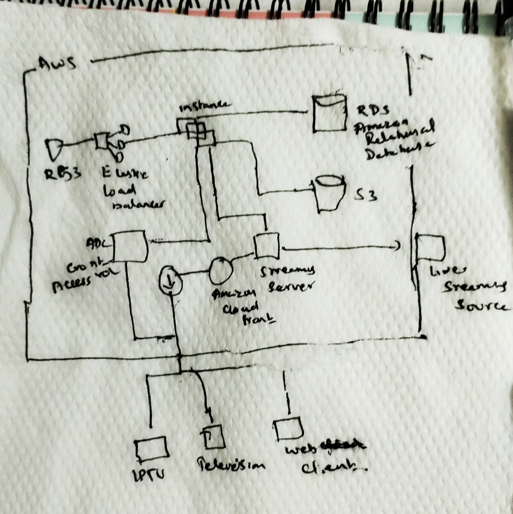
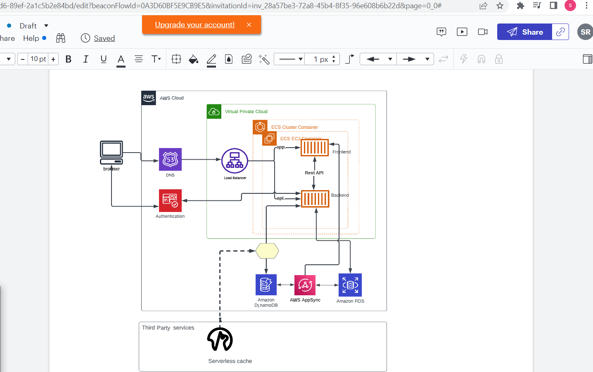

# Week 0 — Billing and Architecture
## Required HomeWork

### Install AWS CLI
I was able to install aws cli using the script added to gitpod.yml. 
Committed the code in the file gitpod.yml file.Initially made a mistake on the script and when i load the gitpod again, i noticed script is failing to install the aws. Then Fixed the issue and its working successfully .
Recommitted the code with the corrections.
Executed the cli command to verify the configuration completed.

### AWS Billing Alarm
I have created a Billing alarm for $10 using cloud watch. If there is any resources usaged crossed $10 then alarm will be generated to my mail id 

### AWS Budget
I have created a buget for $1 .Since it is minimal value i have created single budget inorder to avoid cost for creating more than 2 budget.Since budget value is low did not create any threshold inbetween .

### Recreate Architectural Diagram

## Napkin Pic

Basic AWS Architecture for loading website on S3

AWS Architecture using napkin

## Lucid Chart AWS Architecture Diagram
Using Lucid chart Prepared the aws architecture diagram as described in the homework.

[Luicd Chart Shared Link](https://lucid.app/lucidchart/f7ff36c9-ea5e-46d6-89ef-2a1c5b2e84bd/edit?viewport_loc=-436%2C108%2C2560%2C1232%2C0_0&invitationId=inv_28a57be3-72a8-45b4-8f35-96e608b6b22d
)
## HomeWork Challengs.

