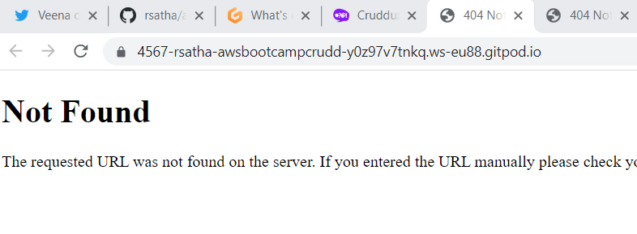
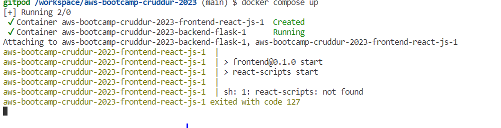

9# Week 1 — App Containerization
## Required HomeWork
Task completed during the week1 by using gitpod workspace.

1.**Containerizing the Backend**

To containerize your applications, you have to start off by creating Dockerfiles for each of your services. In this [link](https://docs.docker.com/develop/develop-images/dockerfile_best-practices/), you will find a detailed explanation and best practices on how to create for each services.

for backend , create a file name **Dockerfile** in the backend-flask directory. update the file with the below configurations.

``` bash
# This image is fetched from Docker Hub
FROM python:3.10-slim-buster

# Create this directory within the container 
WORKDIR /backend-flask

# Copy this file from your computer to the container: source -> destination 
# This file contains the libraries needed to run the app
COPY requirements.txt requirements.txt

# Run this cmd in the container 
# This is to install the python libraries needed for the app
RUN pip3 install -r requirements.txt

# Copy everything in the current directory to the container 
COPY . .

# Set env variables in the container 
# This is a way to configure our environment
ENV FLASK_ENV=development

# This will expose our app port 4567 
EXPOSE ${PORT}

# -m means to use the flask module
# --host=0.0.0.0 is for setting the port in the container 
# --port=4567 is for setting the app port
CMD [ "python3", "-m" , "flask", "run", "--host=0.0.0.0", "--port=4567"]
```

To execute the Dockerfile create with above content, with the below command on the terminal to create an image.

```bash
# This is to build our image while in the backend-flask/ directory
# -t is for naming the image 
docker build -t backend-flask .

# to tag the image use the ":"
docker build -t backend-flask:v1.0 .
```

Start up the container with the image built 

```bash
docker run --rm -p 4567:4567 -it backend-flask:v1.0
```

Initially we get 404 error due to no connection between the backend code built and front end code .



That is because we don't have any env variables set in the container for our application. Let's investigate to be sure that is the reason.

To enter into a running container, use this command:

``` bash
docker exec -it <CONTAINER_NAME> /bin/bash

# to investigate the ENV variables - FRONTEND & BACKEND URLs
env 

# OR
env | grep FRONTEND 
env | grep BACKEND
```
If Those variables are not set. Need to set those envirnment variables with below command .

``` bash
docker run --rm -p 4567:4567 -it -e FRONTEND_URL='*' -e BACKEND_URL='*' backend-flask:v1.0
```

Above command  will fix the 404 error. To verify the same just append the existing link with url  /api/activities/home to your backend URL and you should get output as jason file  as below.


2. Containerizing the Frontend
For the frontend, create a Dockerfile in the frontend-react-js directory with the below code.

``` bash
# This image is fetched from Docker Hub
FROM node:16.18

# set the port for the app
ENV PORT=3000

# copy everything in my computer to the /frontend-react-js directory in the container
COPY . /frontend-react-js

# set the working directory to /frontend-react-js
WORKDIR /frontend-react-js

# install npm 
RUN npm install

# expose the app port 3000
EXPOSE ${PORT}

# start the frontend 
CMD ["npm", "start"]
```

Build the Dockerfile you created into an image with the below command.

```bash

# This is to build our image while in the frontend-react-js/ directory
# -t is for naming the image 
docker build -t frontend-react-js .

# to tag the image use the ":"
docker build -t frontend-react-js:v1.0 .
```

Start the frontend container using the image built with the below command,

```bash
docker run --rm -p 3000:3000 -it frontend-react-js:v1.0
```

3. Using docker-compose to handle both services

The use of docker compose helps us deal with multiple containers. In this link, you will find a detailed explanation and best practices on how to create one.
Lets create docker-compose.yml file with below content 

```bash
version: "3.8"

# here is where you declare your services -> frontend & backend 
services:

  # BACKEND
  backend-flask:

    # passing our env variables
    environment:
      FRONTEND_URL: "https://3000-${GITPOD_WORKSPACE_ID}.${GITPOD_WORKSPACE_CLUSTER_HOST}"
      BACKEND_URL: "https://4567-${GITPOD_WORKSPACE_ID}.${GITPOD_WORKSPACE_CLUSTER_HOST}"
    
    # building our image
    build: ./backend-flask

    # mapping our ports -> local:container
    ports:
      - "4567:4567"
    
    # mapping our volumes -> local:container
    volumes:
      - ./backend-flask:/backend-flask
  
  # FRONTEND
  frontend-react-js:
    
    # passing our env variables
    environment:
      REACT_APP_BACKEND_URL: "https://4567-${GITPOD_WORKSPACE_ID}.${GITPOD_WORKSPACE_CLUSTER_HOST}"
    
    # building our image
    build: ./frontend-react-js
    
    # mapping our ports -> local:container
    ports:
      - "3000:3000"
    
    # mapping our volumes -> local:container
    volumes:
      - ./frontend-react-js:/frontend-react-js

# the name flag is a hack to change the default prepend folder
# name when outputting the image names
networks: 
  internal-network:
    driver: bridge
    name: cruddur
 ```
 
 Once the image is build. we need to start up the container using the below command .
    
    ```bash
    docker compose up
    ```
    
have to make both the ports of backend and frontend as public. Now you could see the service up and running.

Sometimes we get error while docker is loaded as below due to missing of npm install configuration in the frontend directory.




