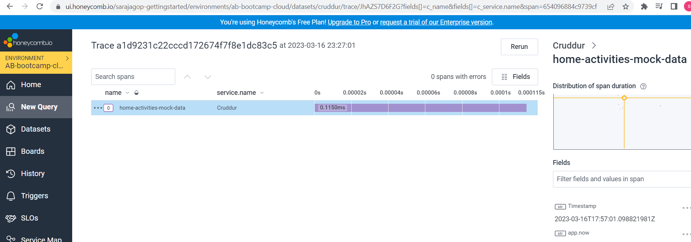
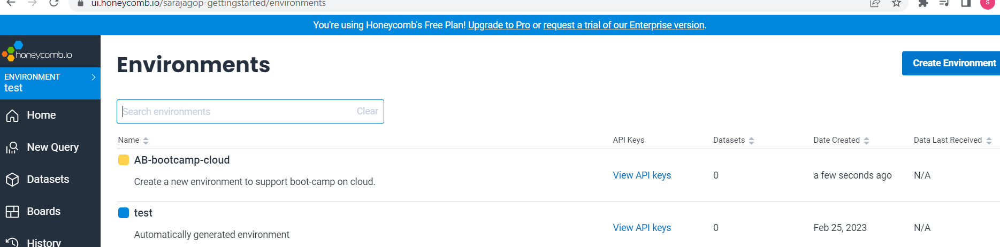
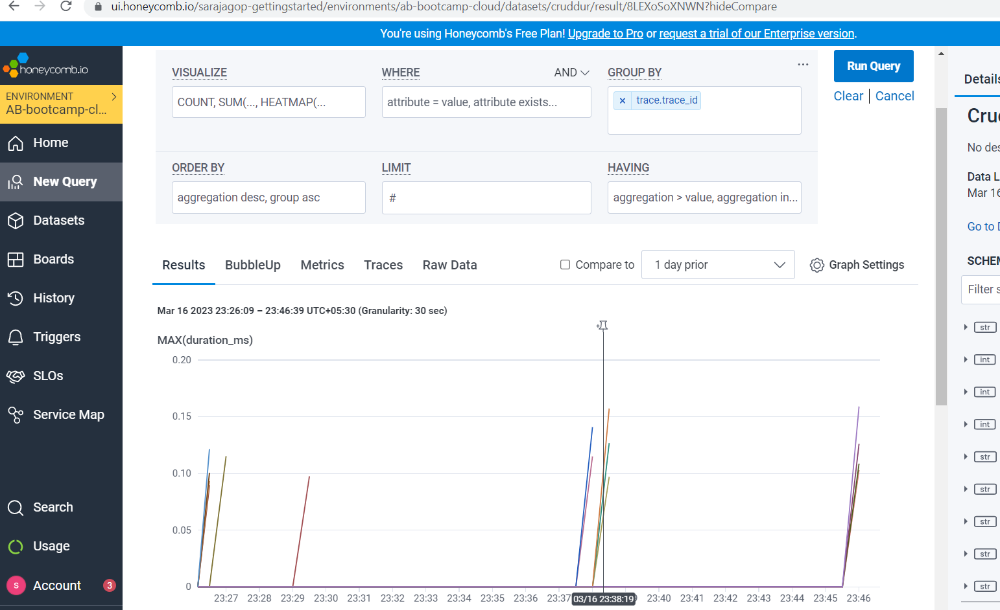
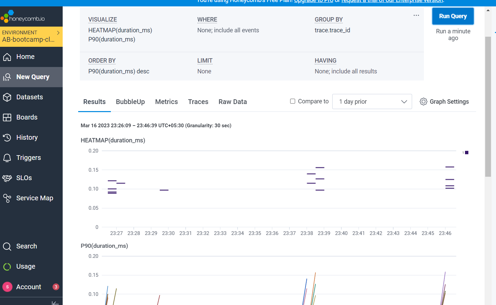
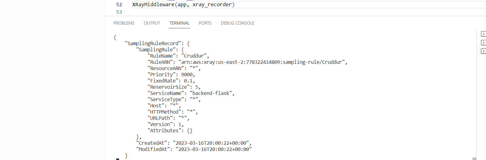
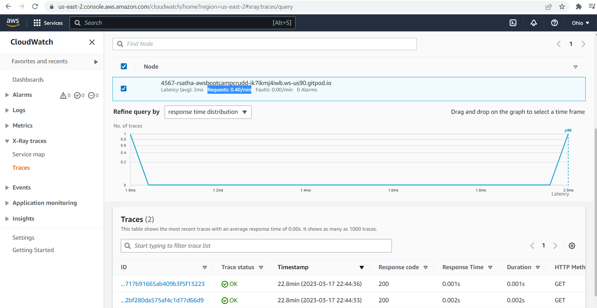
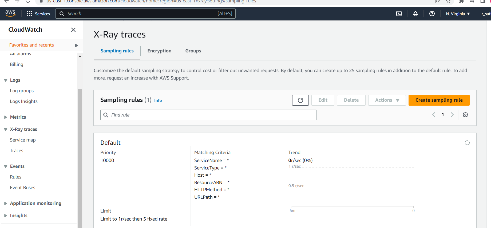
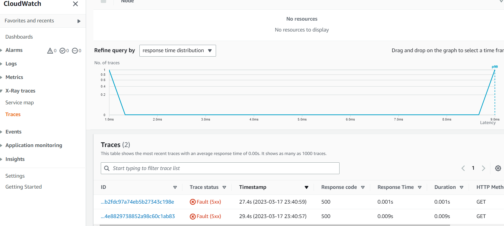
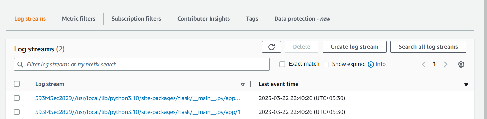
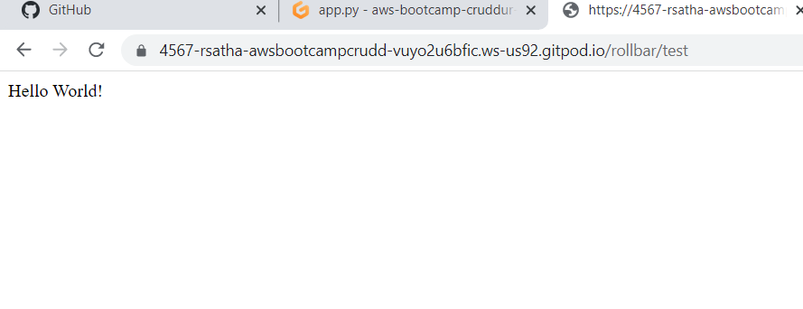

# Week 2 — Distributed Tracing

## Required Homework/Tasks
All the tasks completed under this section is done using Gitpod workspace.

1)Bringing Up Honeycomb

environement setting up in honeycomb.
Login up to honeycomb [link](https://ui.honeycomb.io/).

Once logged in to honeycomb main page, goto ENVIRONMENT on the left panel of your page as below
.

Click Manage Environments to create new environment with description and choose any color for representing .
After creation of new environment file.
.

Now,  the API keys under View API keys. The API keys you use determines the environment that data will land in.

Let's export our API key to gitpod using the commands below:

```bash
# to export it to our gitpod terminal 
export HONEYCOMB_API_KEY="..."

# confirm export 
env | grep HONEY

# to have it permanently saved unto gitpod env variables
# when it starts next time, we don't have to export it again  
gp env HONEYCOMB_API_KEY="..."
```

2. Instrument backend flask to use OpenTelemetry (OTEL) with Honeycomb.io as the provider

Honeycomb is a software debugging tool that can help us to solve problems faster within your distributed services. 
It uses OTEL libraries which is simply the OpenTelemetry libraries. For further [refer](https://www.honeycomb.io/)

Let's set honeycomb env variable for our backend in the docker-compose.yml file. using below code,

```BASH
# honeycomb env variables 
OTEL_SERVICE_NAME: 'backend-flask'
OTEL_EXPORTER_OTLP_ENDPOINT: "https://api.honeycomb.io"
OTEL_EXPORTER_OTLP_HEADERS: "x-honeycomb-team=${HONEYCOMB_API_KEY}"
```

Now, let's install the OTEL libraries into our application. 
Add the following lines to the requirements.txt file located in the backend-flask/ directory

```BASH
opentelemetry-api 
opentelemetry-sdk 
opentelemetry-exporter-otlp-proto-http 
opentelemetry-instrumentation-flask 
opentelemetry-instrumentation-requests # this should instrument outgoing HTTP calls
```

To install the dependencies you listed in the requirements.txt file In the backend-flask directory, run the following command:

```BASH
pip install -r requirements.txt
```

create and initialize honeycomb by adding the following lines of code to app.py file

```PYTHON
# Honeycomb
from opentelemetry import trace
from opentelemetry.instrumentation.flask import FlaskInstrumentor
from opentelemetry.instrumentation.requests import RequestsInstrumentor
from opentelemetry.exporter.otlp.proto.http.trace_exporter import OTLPSpanExporter
from opentelemetry.sdk.trace import TracerProvider
from opentelemetry.sdk.trace.export import BatchSpanProcessor

# Initialize tracing and an exporter that can send data to Honeycomb
provider = TracerProvider()
processor = BatchSpanProcessor(OTLPSpanExporter())
provider.add_span_processor(processor)
trace.set_tracer_provider(provider)
tracer = trace.get_tracer(__name__)

# Initialize automatic instrumentation with Flask
app = Flask(__name__) # if this link already exists, DON'T call it again
FlaskInstrumentor().instrument_app(app)
RequestsInstrumentor().instrument()
```

Now time to build the docker using ``` docker compose up ```

* check which API key is set in environment . Do that by checking your env variables env | grep HONEYCOMB_API_KEY
* Create a span, with configured tracer  in the file ```backend-flask/services/home_activities.py``` 
```PHYTHON 
# add under def run():
with tracer.start_as_current_span("home-activities-mock-data"):
# make sure every other line beneath is properly indented under the code you pasted 
```

* Adding attributes to the span in the homea_activities.py file

```PYTHON
# in the def run(): section
# add attribute -> app.now 
span = trace.get_current_span()
span.set_attribute("app.now", now.isoformat())
# at the bottom -> app.result_length
span.set_attribute("app.result_length", len(results))
```






3. Instrument AWS X-ray into the backend
 
 AWS X-Ray provides a complete view of requests as they travel through your application and filters visual data across payloads, functions, traces, services, APIs, and more with no-code and low-code motions. Read further [from](https://aws.amazon.com/xray/)
 
 **Install AWS X-ray**
 
 First, we need to install the [AWS SDK](https://github.com/aws/aws-xray-sdk-python)
 
 Add the following lines to the requirements.txt file in the backend-flask/ directory
 ``` bash
 aws-xray-sdk
 ```
 install the dependencies you listed in the requirements.txt file In the backend-flask directory, using ```pip install -r requirements.txt```.
 
 Instrument X-ray for Flask
 
 Add the following lines of code to the backend-flask/app.py.
 
 ```PYTHON
 from aws_xray_sdk.core import xray_recorder
 from aws_xray_sdk.ext.flask.middleware import XRayMiddleware

 xray_url = os.getenv("AWS_XRAY_URL")
 xray_recorder.configure(service='backend-flask', dynamic_naming=xray_url)

 XRayMiddleware(app, xray_recorder)
 ```
 
 **Create sampling rule**
 
 Create a json file in the aws/json directory
 Add the following lines of code to your newly created file:
 
 ```
 {
  "SamplingRule": {
      "RuleName": "Cruddur",
      "ResourceARN": "*",
      "Priority": 9000,
      "FixedRate": 0.1,
      "ReservoirSize": 5,
      "ServiceName": "backend-flask",
      "ServiceType": "*",
      "Host": "*",
      "HTTPMethod": "*",
      "URLPath": "*",
      "Version": 1
  }
}
```

Create a xray trace group and configure cli command to add the sampling rules as below 

```bash
# create a trace group in AWS x-ray
aws xray create-group \
   --group-name "Cruddur" \
   --filter-expression "service(\"backend-flask\")"

# create a sampling rule
aws xray create-sampling-rule --cli-input-json file://aws/json/xray.json
```

Configure X-ray daemon with docker-compose

Setup the daemon in the docker-compose.yml file by adding these following lines:

```bash
# add these env variables above in the ENV section
AWS_XRAY_URL: "*4567-${GITPOD_WORKSPACE_ID}.${GITPOD_WORKSPACE_CLUSTER_HOST}*"
AWS_XRAY_DAEMON_ADDRESS: "xray-daemon:2000"

xray-daemon:
    image: "amazon/aws-xray-daemon"
    environment:
      AWS_ACCESS_KEY_ID: "${AWS_ACCESS_KEY_ID}"
      AWS_SECRET_ACCESS_KEY: "${AWS_SECRET_ACCESS_KEY}"
      AWS_REGION: "us-east-1"
    command:
      - "xray -o -b xray-daemon:2000"
    ports:
      - 2000:2000/udp
 ```
 
 
 
 
 
 
 
##Create a custom segment and subsegment with AWS X-ray

follow the configurations in the [document](https://github.com/aws/aws-xray-sdk-python#start-a-custom-segmentsubsegment) on how to create segments and subsegments

In the backend-flask/services/user_activities.py file, add the following changes:

```PYTHON
from aws_xray_sdk.core import xray_recorder

# Add in the def run(user_handle): section, 
# but below, before the return statement
# Start a segment
	subsegment = xray_recorder.begin_segment('mock-data')

    dict = {
      "now": now.isoformat(),
      "results-size": len(model['data'])
    }

    subsegment.put_metadata('key', dict, 'namespace')

    # Close subsegment
    xray_recorder.end_subsegment()
 ```
 Make changes in the app.py as below,
 
 ```PYTHON
 # replace these blocks of code with this

@app.route("/api/activities/home", methods=['GET'])
@xray_recorder.capture('activities_home')
def data_home():
  data = HomeActivities.run(logger=LOGGER)
  return data, 200

@app.route("/api/activities/@<string:handle>", methods=['GET'])
@xray_recorder.capture('activities_users')
def data_handle(handle):
  model = UserActivities.run(handle)
  if model['errors'] is not None:
    return model['errors'], 422
  else:
    return model['data'], 200

@app.route("/api/activities/<string:activity_uuid>", methods=['GET'])
@xray_recorder.capture('activities_show')
def data_show_activity(activity_uuid):
  data = ShowActivity.run(activity_uuid=activity_uuid)
  return data, 200
```

 
 
 
4.Install WatchTower & write custom logger to send app log data to CloudWatch Log Group

Add ```watchtower``` to the ```requirment.txt``` file in the ```backend-flask``` code.
Install the dependencies listed in the ```requirment.txt``` file with below command 

```BASH
pip install -r requirements.txt
```

**Set environment variables for watchtower**

In the ```docker-compose.yml``` file, add the following lines:

```BASH
AWS_DEFAULT_REGION: "${AWS_DEFAULT_REGION}"
AWS_ACCESS_KEY_ID: "${AWS_ACCESS_KEY_ID}"
AWS_SECRET_ACCESS_KEY: "${AWS_SECRET_ACCESS_KEY}"
```

configure the cloudwatch logger in app.py file as below 

```PYTHON
# CloudWatch Logs
import watchtower
import logging
from time import strftime

# Configuring Logger to Use CloudWatch
LOGGER = logging.getLogger(__name__)
LOGGER.setLevel(logging.DEBUG)
console_handler = logging.StreamHandler()
cw_handler = watchtower.CloudWatchLogHandler(log_group='cruddur')
LOGGER.addHandler(console_handler)
LOGGER.addHandler(cw_handler)
LOGGER.info("test message")
```

```PYTHON
@app.after_request
def after_request(response):
    timestamp = strftime('[%Y-%b-%d %H:%M]')
    LOGGER.error('%s %s %s %s %s %s', timestamp, request.remote_addr, request.method, request.scheme, request.full_path, response.status)
    return response
```

Now, log some message in one of the API endpoint by adding the following lines to our backend-flask/services/home_activities.py file:

```PYTHON
# in the class HomeActivities: section, update and add these lines
def run(logger):
    logger.info("HomeActivities")
```

modify the data_home api with below changes,

```PHYTHON
@app.route("/api/activities/home", methods=['GET'])
def data_home():
  data = HomeActivities.run(logger=LOGGER)
  return data, 200
```



5.Integrate Rollbar for Error Logging

Rollbar is a cloud-based bug tracking and monitoring solution that caters to organizations of all sizes. Read [more](https://rollbar.com/)

Add ```blinker, rollbar``` to the ```requirements.txt``` file in the ```backend-flask/``` directory

install the dependencies listed in the ```requirements.txt``` file In the backend-flask directory, run the following command:

```BASH
pip install -r requirements.txt
```

set the environment configurations, 

```BASH
export ROLLBAR_ACCESS_TOKEN=""
gp env ROLLBAR_ACCESS_TOKEN=""
```

Add ACCESS_TOKEN to docker-compose.yml file

```BASH

# under environment variables
ROLLBAR_ACCESS_TOKEN: "${ROLLBAR_ACCESS_TOKEN}"

```

Import Rollbar Libraries

Let's import the rollbar libraries Add the following lines in the app.py file

```PHYTHON
# Rollbar
import rollbar
import rollbar.contrib.flask
from flask import got_request_exception

# after app = Flask(__name__), to avoid errors
# add these lines 
rollbar_access_token = os.getenv('ROLLBAR_ACCESS_TOKEN')
@app.before_first_request
def init_rollbar():
    """init rollbar module"""
    rollbar.init(
        # access token
        rollbar_access_token,
        # environment name
        'production',
        # server root directory, makes tracebacks prettier
        root=os.path.dirname(os.path.realpath(__file__)),
        # flask already sets up logging
        allow_logging_basic_config=False)

    # send exceptions from `app` to rollbar, using flask's signal system.
    got_request_exception.connect(rollbar.contrib.flask.report_exception, app)

```

Add Rollbar Endpoint

make changes to the @app.route to add the rollbar endpoint 

```PYTHON
@app.route('/rollbar/test')
def rollbar_test():
    rollbar.report_message('Hello World!', 'warning')
    return "Hello World!"
```
bring up the docker using ```docker compose up``` 
Afterward, test out the new endpoint you added by appending /rollbar/test to your backend URL




